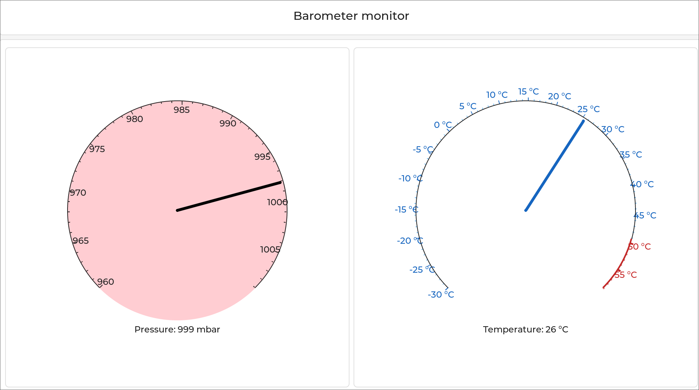

===========================================
``baromonitor`` Barometer Dashboard Example
===========================================

This example is used to demonstrate a practical use case for an LVGL application
on NuttX. It subscribes to a barometer sensor topic and displays the pressure
and temperature information on animated gauges.

   The barometer dashboard in action

To use the barometer dashboard, just ensure there is a ``sensor_baro`` topic
registered on the target and then run ``baromonitor``. These sensor topics are
registered by NuttX barometer sensor drivers (see
:doc:`/components/drivers/special/sensors/sensors_uorb`).

By default, the application attempts to subscribe to ``sensor_baro0``, but if
you wish to monitor a different barometer topic you can pass the instance number
as an argument (i.e. ``baromonitor 2`` subscribes to ``sensor_baro2``).

For maximum compatibility with all sensors (those that publish on their own via
interrupts/kernel threads _and_ those that only fetch data when read from), the
application takes the approach of reading sensor data in a loop at a rate
defined by ``CONFIG_EXAMPLES_BAROMONITOR_SAMPLERATE``.
