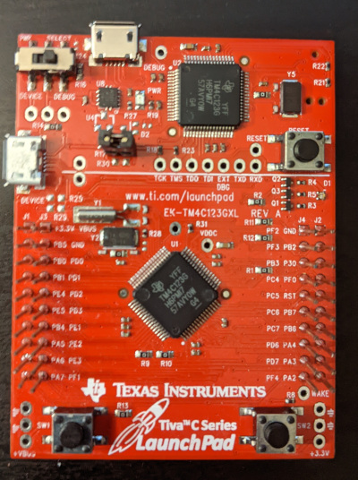

=========================
TM4C123G Tiva C LaunchPad
=========================

.. tags:: chip:tm4c123, arch:arm, vendor:tiva

   The TM4C123G Tiva C Launchpad board.

The Tiva TM4C123G LaunchPad Evaluation Board is a low-cost evaluation platform for ARM
Cortex-M4F-based microcontrollers from Texas Instruments.

On-Board GPIO Usage
===================

=== ======================================== ============================================
PIN SIGNAL(S)                                LanchPad Function
=== ======================================== ============================================
 17 PA0/U0RX                                 DEBUG/VCOM, Virtual COM port receive
 18 PA1/U0TX                                 DEBUG/VCOM, Virtual COM port transmit
 19 PA2/SSIOCLK                              GPIO, J2 pin 10
 20 PA3/SSIOFSS                              GPIO, J2 pin 9
 21 PA4/SSIORX                               GPIO, J2 pin 8
 22 PA5/SSIOTX                               GPIO, J1 pin 8
 23 PA6/I2CLSCL                              GPIO, J1 pin 9
 24 PA7/I2CLSDA                              GPIO, J1 pin 10

 45 PB0/T2CCP0/U1Rx                          GPIO, J1 pin 3
 46 PB1/T2CCP1/U1Tx                          GPIO, J1 pin 4
 47 PB2/I2C0SCL/T3CCP0                       GPIO, J2 pin 2
 48 PB3/I2C0SDA/T3CCP1                       GPIO, J4 pin 3
 58 PB4/AIN10/CAN0Rx/SSI2CLK/T1CCP0          GPIO, J1 pin 7
 57 PB5/AIN11/CAN0Tx/SSI2FSS/T1CCP1          GPIO, J1 pin 2
 01 PB6/SSI2RX/T0CCP0                        Connects to PD0 via resistor, GPIO, J2 pin 7
 04 PB7/SSI2TX/T0CCP1                        Connects to PD1 via resistor, GPIO, J2 pin 6

 52 PC0/SWCLK/T4CCP0/TCK                     DEBUG/VCOM
 51 PC1/SWDIO/T4CCP1/TMS                     DEBUG/VCOM
 50 PC2/T5CCP0/TDI                           DEBUG/VCOM
 49 PC3/SWO/T5CCP1/TDO                       DEBUG/VCOM
 16 PC4/C1-/U1RTS/U1RX/U4RX/WT0CCP0          GPIO, J4 pin 4
 15 PC5/C1+/U1CTS/U1TX/U4TX/WT0CCP1          GPIO, J4 pin 5
 14 PC6/C0+/U3RX/WT1CCP0                     GPIO, J4 pin 6
 13 PC7/C0-/U3TX/WT1CCP1                     GPIO, J4 pin 7

 61 PD0/AIN7/I2C3SCL/SSI1CLK/SSI3CLKWT2CCP0  Connects to PB6 via resistor, GPIO, J3 pin 3
 62 PD1/AIN6/I2C3SDA/SSI1Fss/SSI3Fss/WT2CCP1 Connects to PB7 via resistor, GPIO, J3 Pin 4
 63 PD2/AIN5/SSI1RX/SSI3RX/WT3CCP0           GPIO, J3 pin 5
 64 PD3/AIN4/SSI1TX/SSI3TX/WT3CCP1           GPIO, J3 pin 6
 43 PD4/U6RX/USB0DM/WT4CCP0                  USB_DM
 44 PD5/U6TX/USB0DP/WT4CCP1                  USB_DP
 53 PD6/U2RX/WT5CCP0                         GPIO, J4 pin 8
 10 PD7/NMI/U2TX/WT5CCP1                     +USB_VBUS, GPIO, J4 pin 9
                                             Used for VBUS detection when
                                             configured as a self-powered USB
                                             Device

 09 PE0/AIN3/U7RX                            GPIO, J2 pin 3
 08 PE1/AIN2/U7TX                            GPIO, J3 pin 7
 07 PE2/AIN1                                 GPIO, J3 pin 8
 06 PE3/AIN0                                 GPIO, J3 pin 9
 59 PE4/AIN9/CAN0RX/I2C2SCL/U5RX             GPIO, J1 pin 5
 60 PE5/AIN8/CAN0TX/I2C2SDA/U5TX             GPIO, J1 pin 6

 28 PF0/C0O/CAN0RX/NMI/SSI1RX/T0CCP0/U1RTS   USR_SW2 (Low when pressed), GPIO, J2 pin 4
 29 PF1/C1O/SSI1TX/T0CCP1/TRD1/U1CTS         LED_R, GPIO, J3 pin 10
 30 PF2/SSI1CLK/T1CCP0/TRD0                  LED_B, GPIO, J4 pin 1
 31 PF3/CAN0TX/SSI1FSS/T1CCP1/TRCLK          LED_G, GPIO, J4 pin 2
 05 PF4/T2CCP0                               USR_SW1 (Low when pressed), GPIO, J4 pin 10
=== ======================================== ============================================

AT24 Serial EEPROM
==================

AT24 Connections
----------------

A AT24C512 Serial EEPPROM was used for tested I2C.  There are no I2C
devices on-board the Launchpad, but an external serial EEPROM module
module was used.

The Serial EEPROM was mounted on an external adaptor board and connected
to the LaunchPad thusly:

- VCC  J1 pin 1  3.3V
       J3 pin 1  5.0V
- GND  J2 pin 1  GND
       J3 pin 2  GND
- PB2  J2 pin 2  SCL
- PB3  J4 pin 3  SDA

Configuration Settings
----------------------

The following configuration settings were used:

System Type -> Tiva/Stellaris Peripheral Support

.. code-block:: console

    CONFIG_TIVA_I2C0=y                    : Enable I2C

System Type -> I2C device driver options

.. code-block:: console

    TIVA_I2C_FREQUENCY=100000             : Select an I2C frequency

Device Drivers -> I2C Driver Support

.. code-block:: console

    CONFIG_I2C=y                          : Enable I2C support

Device Drivers -> Memory Technology Device (MTD) Support

.. code-block:: console

    CONFIG_MTD=y                          : Enable MTD support
    CONFIG_MTD_AT24XX=y                   : Enable the AT24 driver
    CONFIG_AT24XX_SIZE=512                : Specifies the AT 24C512 part
    CONFIG_AT24XX_ADDR=0x53               : AT24 I2C address

Application Configuration -> NSH Library

.. code-block:: console

    CONFIG_NSH_ARCHINIT=y                 : NSH board-initialization

File systems

.. code-block:: console

    CONFIG_NXFFS=y                        : Enables the NXFFS file system
    CONFIG_NXFFS_PREALLOCATED=y           : Required
                                          : Other defaults are probably OK

Board Selection

.. code-block:: console

    CONFIG_TM4C123G_LAUNCHPAD_AT24_BLOCKMOUNT=y   : Mounts AT24 for NSH
    CONFIG_TM4C123G_LAUNCHPAD_AT24_NXFFS=y        : Mount the AT24 using NXFFS

You can then format the AT24 EEPROM for a FAT file system and mount the
file system at /mnt/at24 using these NSH commands:

.. code-block:: console

    nsh> mkfatfs /dev/mtdblock0
    nsh> mount -t vfat /dev/mtdblock0 /mnt/at24

Then you an use the FLASH as a normal FAT file system:

.. code-block:: console

    nsh> echo "This is a test" >/mnt/at24/atest.txt
    nsh> ls -l /mnt/at24
    /mnt/at24:
     -rw-rw-rw-      16 atest.txt
    nsh> cat /mnt/at24/atest.txt
    This is a test

.. note::

    (2014-12-12) I was unsuccessful getting my AT24 module to work on the TM4C123G
    LaunchPad.  I was unable to successuflly communication with the AT24 via
    I2C.  I did verify I2C using the I2C tool and other I2C devices and I now
    believe that my AT24 module is not fully functional.

I2C Tool
========

NuttX supports an I2C tool at apps/system/i2c that can be used
to peek and poke I2C devices.  That tool can be enabled by setting the
following:

System Type -> TIVA Peripheral Support

.. code-block:: console

    CONFIG_TIVA_I2C0=y                   : Enable I2C0
    CONFIG_TIVA_I2C1=y                   : Enable I2C1
    CONFIG_TIVA_I2C2=y                   : Enable I2C2
    ...

System Type -> I2C device driver options

.. code-block:: console

    CONFIG_TIVA_I2C0_FREQUENCY=100000    : Select an I2C0 frequency
    CONFIG_TIVA_I2C1_FREQUENCY=100000    : Select an I2C1 frequency
    CONFIG_TIVA_I2C2_FREQUENCY=100000    : Select an I2C2 frequency
    ...

Device Drivers -> I2C Driver Support

.. code-block:: console

    CONFIG_I2C=y                          : Enable I2C support

Application Configuration -> NSH Library

.. code-block:: console

    CONFIG_SYSTEM_I2CTOOL=y               : Enable the I2C tool
    CONFIG_I2CTOOL_MINBUS=0               : I2C0 has the minimum bus number 0
    CONFIG_I2CTOOL_MAXBUS=2               : I2C2 has the maximum bus number 2
    CONFIG_I2CTOOL_DEFFREQ=100000         : Pick a consistent frequency

More information about `I2C <https://nuttx.apache.org/docs/latest/applications/system/i2c/index.html>`_

Using OpenOCD and GDB with an FT2232 JTAG emulator
===================================================

Building OpenOCD under Cygwin:

  Refer to Documentation/platforms/arm/lpc17xx/boards/olimex-lpc1766stk/README.txt

Installing OpenOCD in Linux:

.. code-block:: console

    sudo apt-get install openocd

As of this writing, there is no support for the tm4c123g in the package
above. You will have to build openocd from its source (as of this writing
the latest commit was b9b4bd1a6410ff1b2885d9c2abe16a4ae7cb885f):

.. code-block:: console

    git clone http://git.code.sf.net/p/openocd/code openocd
    cd openocd

Then, add the patches provided by http://openocd.zylin.com/922:

.. code-block:: console

    git fetch http://openocd.zylin.com/openocd refs/changes/22/922/14 && git checkout FETCH_HEAD
    ./bootstrap
    ./configure --enable-maintainer-mode --enable-ti-icdi
    make
    sudo make install

For additional help, see http://processors.wiki.ti.com/index.php/Tiva_Launchpad_with_OpenOCD_and_Linux

Helper Scripts.

I have been using the on-board In-Circuit Debug Interface (ICDI) interface.
OpenOCD requires a configuration file.  I keep the one I used last here::

    boards/arm/tiva/tm4c123g-launchpad/tools/tm4c123g-launchpad.cfg

However, the "correct" configuration script to use with OpenOCD may
change as the features of OpenOCD evolve.  So you should at least
compare that tm4c123g-launchpad.cfg file with configuration files in
/usr/share/openocd/scripts.  As of this writing, the configuration
files of interest were::

    /usr/local/share/openocd/scripts/board/ek-tm4c123gxl.cfg
    /usr/local/share/openocd/scripts/interface/ti-icdi.cfg
    /usr/local/share/openocd/scripts/target/stellaris_icdi.cfg

There is also a script on the tools/ directory that I use to start
the OpenOCD daemon on my system called oocd.sh.  That script will
probably require some modifications to work in another environment:

- Possibly the value of OPENOCD_PATH and TARGET_PATH
- It assumes that the correct script to use is the one at
  boards/arm/tiva/tm4c123g-launchpad/tools/tm4c123g-launchpad.cfg

Starting OpenOCD

If you are in the top-level NuttX build directlory then you should
be able to start the OpenOCD daemon like:

.. code-block:: console

    oocd.sh $PWD

The relative path to the oocd.sh script is::

    boards/arm/tiva/tm4c123g-launchpad/tools.

You may want to add that path to your PATH variable.

Note that OpenOCD needs to be run with administrator privileges in
some environments (sudo).

Connecting GDB

Once the OpenOCD daemon has been started, you can connect to it via
GDB using the following GDB command:

.. code-block:: console

    arm-nuttx-elf-gdb
    (gdb) target remote localhost:3333

NOTE:  The name of your GDB program may differ.  For example, with the
CodeSourcery toolchain, the ARM GDB would be called arm-none-eabi-gdb.

After starting GDB, you can load the NuttX ELF file:

.. code-block:: console

    (gdb) symbol-file nuttx
    (gdb) monitor reset
    (gdb) monitor halt
    (gdb) load nuttx

NOTES:

1. Loading the symbol-file is only useful if you have built NuttX to
   include debug symbols (by setting CONFIG_DEBUG_SYMBOLS=y in the
   .config file).
2. The MCU must be halted prior to loading code using 'mon reset'
   as described below.

OpenOCD will support several special 'monitor' commands.  These
GDB commands will send comments to the OpenOCD monitor.  Here
are a couple that you will need to use:

.. code-block:: console

    (gdb) monitor reset
    (gdb) monitor halt

NOTES:

1. The MCU must be halted using 'mon halt' prior to loading code.
2. Reset will restart the processor after loading code.
3. The 'monitor' command can be abbreviated as just 'mon'.

LEDs
====

The TM4C123G has a single RGB LED.  If CONFIG_ARCH_LEDS is defined, then
support for the LaunchPad LEDs will be included in the build.  See:

- boards/arm/tiva/tm4c123g-launchpad/include/board.h - Defines LED
  constants, types and prototypes the LED interface functions.

- boards/arm/tiva/tm4c123g-launchpad/src/tm4c123g-launchpad.h - GPIO
  settings for the LEDs.

- boards/arm/tiva/tm4c123g-launchpad/src/up_leds.c - LED control logic.

OFF:
  - OFF means that the OS is still initializing. Initialization is very fast so
    if you see this at all, it probably means that the system is hanging up
    somewhere in the initialization phases.

GREEN or GREEN-ish
  - This means that the OS completed initialization.

Bluish:
  - Whenever and interrupt or signal handler is entered, the BLUE LED is
    illuminated and extinguished when the interrupt or signal handler exits.
    This will add a BLUE-ish tinge to the LED.

Redish:
  - If a recovered assertion occurs, the RED component will be illuminated
    briefly while the assertion is handled.  You will probably never see this.

Flashing RED:
  - In the event of a fatal crash, the BLUE and GREEN components will be
    extinguished and the RED component will FLASH at a 2Hz rate.

Serial Console
==============

By default, all configurations use UART0 which connects to the USB VCOM
on the DEBUG port on the TM4C123G LaunchPad::

    UART0 RX - PA.0
    UART0 TX - PA.1

However, if you use an external RS232 driver, then other options are
available.  UART1 has option pin settings and flow control capabilities
that are not available with the other UARTS::

    UART1 RX - PB.0 or PC.4 (Need disambiguation in board.h)
    UART1 TX - PB.1 or PC.5 ("  " "            " "" "     ")

    UART1_RTS - PF.0 or PC.4
    UART1_CTS - PF.1 or PC.5

NOTE: board.h currently selects PB.0, PB.1, PF.0 and PF.1 for UART1, but
that can be changed by editing board.h

UART2-5, 7 are also available, UART2 is not recommended because it shares
some pin usage with USB device mode.  UART6 is not available because its
only RX/TX pin options are dedicated to USB support.::

    UART2 RX - PD.6
    UART2 TX - PD.7 (Also used for USB VBUS detection)

    UART3 RX - PC.6
    UART3 TX - PC.7

    UART4 RX - PC.4
    UART4 TX - PC.5

    UART5 RX - PE.4
    UART5 TX - PE.5

    UART6 RX - PD.4, Not available.  Dedicated for USB_DM
    UART6 TX - PD.5, Not available.  Dedicated for USB_DP

    UART7 RX - PE.0
    UART7 TX - PE.1

USB Device Controller Functions
================================

Device Overview

  An FT2232 device from Future Technology Devices International Ltd manages
  USB-to-serial conversion. The FT2232 is factory configured by Luminary
  Micro to implement a JTAG/SWD port (synchronous serial) on channel A and
  a Virtual COM Port (VCP) on channel B. This feature allows two simultaneous
  communications links between the host computer and the target device using
  a single USB cable. Separate Windows drivers for each function are provided
  on the Documentation and Software CD.

Debugging with JTAG/SWD

  The FT2232 USB device performs JTAG/SWD serial operations under the control
  of the debugger or the Luminary Flash Programmer.  It also operate as an
  In-Circuit Debugger Interface (ICDI), allowing debugging of any external
  target board.  Debugging modes:

  ====  ======================  ============================  ==============================
  MODE  DEBUG FUNCTION          USE                           SELECTED BY
  ====  ======================  ============================  ==============================
  1     Internal ICDI           Debug on-board TM4C123G       Default Mode
                                microcontroller over USB
                                interface.

  2     ICDI out to JTAG/SWD    The EVB is used as a USB      Connecting to an external
        header                  to SWD/JTAG interface to      target and starting debug
                                an external target.           software. The red Debug Out
                                                              LED will be ON.

  3     In from JTAG/SWD        For users who prefer an       Connecting an external
        header                  external debug interface      debugger to the JTAG/SWD
                                (ULINK, JLINK, etc.) with     header.
                                the EVB.

  ====  ======================  ============================  ==============================

Virtual COM Port

  The Virtual COM Port (VCP) allows Windows applications (such as HyperTerminal)
  to communicate with UART0 on the TM4C123G over USB. Once the FT2232 VCP
  driver is installed, Windows assigns a COM port number to the VCP channel.

MCP2515 - SPI - CAN
====================

I like CANbus, and having an MCP2515 CAN Bus Module laying around
gave me the idea to implement it on the TM4C123GXL (Launchpad).
NuttX already had implemented it on the STM32. So a lot of work already
has been done. It uses SPI and with this Launchpad we use SSI.

Here is how I have the MCP2515 Module connected. But you can change
this with the settings in include/board.h and src/tm4c123g-launchpad.h.

Connector pinout that I am using:

========================== ===============================
Connector CAN Module       Launchpad TM4C123GXL (SSI2_1)
========================== ===============================
1  INT                     PB0
2  SCK                     PB4 (Clock)
3  SI                      PB7 (MOSI = TX)
4  SO                      PB6 (MISO = RX)
5  CS                      PB5 (Chip Select)
6  GND                     GND
7  VCC                     VBUS (+5V)
========================== ===============================

PS: I have to test the CS signal when adding it on a bus with multiple nodes.

TM4C123G LaunchPad Configuration Options
=========================================

CONFIG_TIVA_SSI0 - Select to enable support for SSI0

CONFIG_TIVA_SSI1 - Select to enable support for SSI1

CONFIG_SSI_POLLWAIT - Select to disable interrupt driven SSI support.
Poll-waiting is recommended if the interrupt rate would be to
high in the interrupt driven case.

CONFIG_SSI_TXLIMIT - Write this many words to the Tx FIFO before
emptying the Rx FIFO.  If the SPI frequency is high and this
value is large, then larger values of this setting may cause
Rx FIFO overrun errors.  Default: half of the Tx FIFO size (4).

CONFIG_TIVA_ETHERNET - This must be set (along with CONFIG_NET)
to build the Tiva Ethernet driver

CONFIG_TIVA_ETHLEDS - Enable to use Ethernet LEDs on the board.

CONFIG_TIVA_BOARDMAC - If the board-specific logic can provide
a MAC address (via tiva_ethernetmac()), then this should be selected.

CONFIG_TIVA_ETHHDUPLEX - Set to force half duplex operation

CONFIG_TIVA_ETHNOAUTOCRC - Set to suppress auto-CRC generation

CONFIG_TIVA_ETHNOPAD - Set to suppress Tx padding

CONFIG_TIVA_MULTICAST - Set to enable multicast frames

CONFIG_TIVA_PROMISCUOUS - Set to enable promiscuous mode

CONFIG_TIVA_BADCRC - Set to enable bad CRC rejection.

CONFIG_TIVA_DUMPPACKET - Dump each packet received/sent to the console.

Configurations
==============

Each TM4C123G LaunchPad configuration is maintained in a sub-directory of
boards/arm/tiva/tm4c123g-launchpad/configs/ and can be selected as follows:

.. code-block:: console

    tools/configure.sh tm4c123g-launchpad:<subdir>

Where <subdir> is one of the following:

mcp2515
-------

Configuration uses the MCP2515 SPI CAN part.  See the section entitled
"MCP2515 - SPI - CAN" above.

nsh
---

Configures the NuttShell (nsh) located at apps/examples/nsh.  The
configuration enables the serial VCOM interfaces on UART0.  Support for
builtin applications is enabled, but in the base configuration no builtin
applications are selected.

NOTES:

1. This configuration uses the mconf-based configuration tool.  To
   change this configuration using that tool, you should:

   a. Build and install the kconfig-mconf tool.  See nuttx/README.txt
      see additional README.txt files in the NuttX tools repository.

   b. Execute 'make menuconfig' in nuttx/ in order to start the
      reconfiguration process.

2. By default, this configuration uses the ARM EABI toolchain
   for Windows and builds under Cygwin (or probably MSYS).  That
   can easily be reconfigured, of course.

.. code-block:: console

    CONFIG_HOST_LINUX=y                 : Linux (Cygwin under Windows okay too).
    CONFIG_ARM_TOOLCHAIN_BUILDROOT=y : Buildroot (arm-nuttx-elf-gcc)
    CONFIG_RAW_BINARY=y                 : Output formats: ELF and raw binary
