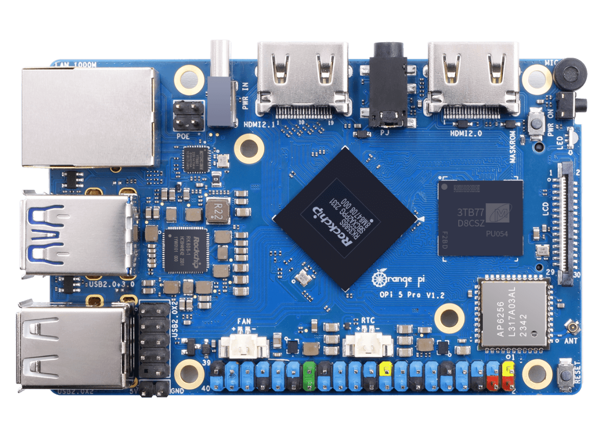

================
Orange Pi 5 Pro
================

.. tags:: arch:arm64, chip:rk3588, vendor:xunlong, experimental

.. warning::

   The board support for this device is experimental. Not all features are
   implemented and they have not been extensively tested by many users.

   Help is wanted if you are interested in supporting a feature or if you've
   found an issue with any of the implementation! See :doc:`the contributing
   guidelines </contributing/index>`.

   Orange Pi 5 Pro Single Board Computer

The `Orange Pi 5 Pro <http://www.orangepi.org/html/hardWare/computerAndMicrocontrollers/details/Orange-Pi-5-Pro.html>`_
is an ARM64 single-board computer based on the Rockchip RK3588S SoC,
created by Shenzhen Xunlong Software.

Features
========

* **SoC**: Rockchip RK3588S (8 nm LP process)
* **CPU**: Octa-core 64-bit (4x Cortex-A76 up to 2.4 GHz + 4x Cortex-A55 up to 1.8 GHz)
* **GPU**: ARM Mali-G610 MP4 (Supports OpenGL ES 1.1/2.0/3.2, OpenCL 2.2, Vulkan 1.2)
* **NPU**: Up to 6 TOPS AI accelerator
* **RAM**: 4/8/16 GB LPDDR5
* **Storage**: eMMC module socket, SPI Flash, MicroSD slot, M.2 M-Key (NVMe/SATA)
* **Ethernet**: Gigabit Ethernet (YT8531C PHY) with PoE+ support (requires PoE+ HAT)
* **Wi-Fi/Bluetooth**: Onboard AP6256 module (Wi-Fi 5 802.11ac + Bluetooth 5.0 / BLE)
* **USB**: 1x USB 3.1 Gen1, 3x USB 2.0 (via onboard USB Hub)
* **Video Output**: HDMI 2.1 (up to 8K @ 60 Hz)
* **Camera**: 2x MIPI CSI 4-lane
* **Expansion**: 40-pin header (UART, PWM, I2C, SPI, CAN, GPIO)
* **Power Supply**: Type-C (5 V @ 5 A)
* **Dimensions**: 89 mm x 56 mm

NuttX Support Status
====================

The initial port supports the core system components, interactive shell, and basic utilities:

* **Core Boot**: Switch from EL2 to EL1, translation tables, and MMU enablement.
* **System Console**: 16550 UART driver operating on UART2.
* **Timer**: ARM generic system timer.
* **PSCI**: System reset / reboot via TF-A PSCI SMC calls.
* **procfs**: Virtual process filesystem.

Other onboard peripherals (GPIO, SPI, I2C, eMMC, USB, Ethernet, Wi-Fi, Bluetooth, HDMI, and MIPI DSI/CSI) are currently not supported in this port.

.. note::

   To see support status for SoC peripherals (I2C, SPI, UART, etc.), see the
   :doc:`RK3588 page <../../index>`.

Buttons and LEDs
================

Buttons
-------

The Orange Pi 5 Pro has three buttons:

* **Power Button**: Used to power the board on or off.
* **Reset Button**: Performs a hardware reset of the board.
* **MaskROM Key**: Used to put the board into MaskROM mode for low-level firmware recovery.

LEDs
----

The board has two onboard status LEDs:

* **Red LED**: Power indicator (hardware-controlled, turns on when power is connected).
* **Green LED**: Status/User LED (software-controlled).

Pin Mapping
===========

Debug Serial Console
--------------------

The debug serial console inherits UART2 from the firmware. The default pin mapping for the UART2 console on the 40-pin expansion header is:

======= ========== =====================================
Pin     Signal     Notes
======= ========== =====================================
8       UART2_TX   Debug UART Transmit (UART2_TXD_M0)
10      UART2_RX   Debug UART Receive (UART2_RXD_M0)
6       Ground     Ground
======= ========== =====================================

Power Supply
============

The board is powered via a Type-C connector. A high-quality power supply providing 5 V @ 5 A is recommended.

Installation
============

Install an ``aarch64-none-elf`` bare-metal toolchain and ensure its
``bin`` directory is on your ``PATH``.

One option is the
`Arm GNU Toolchain <https://developer.arm.com/downloads/-/arm-gnu-toolchain-downloads>`_.

Building NuttX
==============

To build NuttX for the Orange Pi 5 Pro, configure the board first:

.. code:: console

   $ ./tools/configure.sh orangepi-5-pro:nsh
   $ make -j$(nproc) CROSSDEV=aarch64-none-elf-

A successful build produces ``nuttx`` and ``nuttx.bin``.

Booting
=======

Firmware and Relocation
-----------------------

The Orange Pi 5 Pro boots via U-Boot. A typical boot flow is:

BootROM -> DDR initialization/TPL -> U-Boot SPL -> TF-A BL31 -> U-Boot proper -> NuttX

The port relies on the existing firmware for DRAM training, boot media
access, TF-A loading, and the debug UART's clock and pin configuration.
TF-A provides the PSCI interface used by NuttX. U-Boot loads
``nuttx.bin`` and transfers control with the MMU and data cache disabled.

Although the physical DRAM starts at ``0x00000000``, the first 28 MiB (up to ``0x01c00000``)
is reserved by the firmware (TF-A, OP-TEE, U-Boot). U-Boot reports the start of available
RAM as ``0x01c00000``. The NuttX ARM64 startup code uses a standard image load offset of
``0x480000`` (4.5 MiB). U-Boot's ``booti`` command parses this offset from the Image header
and relocates the binary to ``0x02080000`` (``CONFIG_RAM_START``).

The initial port maps a 512 MiB RAM window beginning at ``0x02080000``. Memory outside this
window is not included in the NuttX heap. The initial MMU configuration uses a 40-bit physical
address size.

Boot Procedure
--------------

Follow these steps to boot NuttX:

1. Format a microSD card with a single FAT32 partition.
2. Copy ``nuttx.bin`` to the root of the microSD card.
3. The board DTB is typically already present on the microSD card boot partition (e.g. from a vendor OS image) at `/boot/dtb/rockchip/rk3588s-orangepi-5-pro.dtb`. If not, copy it to the card.
4. Insert the card and connect the 3.3 V debug serial cable.
5. Stop at the U-Boot prompt and run:

   .. code:: console

      => load mmc <dev>:1 0x02000000 /nuttx.bin
      => load mmc <dev>:1 ${fdt_addr_r} /boot/dtb/rockchip/rk3588s-orangepi-5-pro.dtb
      => booti 0x02000000 - ${fdt_addr_r}

6. Confirm the board reaches the NuttX prompt:

   .. code:: text

      NuttShell (NSH) NuttX-13.x
      nsh>

The initial port does not consume the DTB passed by U-Boot. This procedure
has been validated on a 4 GiB Orange Pi 5 Pro. The observed handoff
relocated the image to ``0x02080000``, entered NuttX at EL2, switched to
EL1, and reached the NSH prompt.

Configurations
==============

You can configure NuttX for the Orange Pi 5 Pro using the following
command:

.. code:: console

   $ ./tools/configure.sh orangepi-5-pro:<config>

Where ``<config>`` is one of the configurations listed below.

nsh
---

Interactive NSH configuration for initial board validation. Connect the
3.3 V debug UART at 1500000 baud to access the NuttShell prompt.

ostest
------

Boots directly into ``ostest_main`` for scheduler and OS regression
tests.

Hardware validation
===================

The ``nsh`` configuration was tested on a 4 GiB Orange Pi 5 Pro. UART2
transmit and receive, procfs, the ARM generic timer and PSCI reset were
verified. A five-second ``sleep`` advanced ``/proc/uptime`` by five
seconds, and ``reboot`` returned control to U-Boot.

The ``ostest`` configuration was also run on the same board and completed
with status zero. ``calib_udelay`` measured 116422 delay loops per
millisecond with an R-squared value of 1.0000.

References
==========

* Rockchip RK3588 Brief Datasheet:
  https://www.rock-chips.com/uploads/pdf/2022.8.26/192/RK3588%20Brief%20Datasheet.pdf
* Linux RK3588 device tree:
  https://git.kernel.org/pub/scm/linux/kernel/git/torvalds/linux.git/tree/arch/arm64/boot/dts/rockchip/rk3588-base.dtsi
* U-Boot Rockchip documentation:
  https://docs.u-boot.org/en/latest/board/rockchip/rockchip.html
