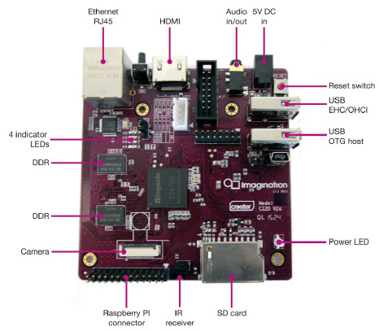

=================
MIPS Creator CI20
=================

.. tags:: arch:mips, chip:jz4780

   The MIPS Creator CI20 V2.0

Supported Features
==================

* Single 1.2GHz MIPS32 processor
* 256MiB DRAM
* UART0 on Raspberry PI connector
* Fast Ethernet (DM9000)

Configurations
==============

.. important::

   U-Boot must be properly configured for networking (e.g., valid ``ipaddr``,
   ``serverip``, and ``ethaddr`` environment variables) to fetch the image over TFTP.

NuttX is loaded via U-Boot using TFTP (replace ``<tftp_dir>`` with your local
TFTP root directory).

You can use the following command to configure the NuttX build:

.. code-block:: shell

  ./tools/configure.sh -l ci20/nsh

   make CROSSDEV=mips-mti-elf-
   mkimage -A mips -O linux -T kernel -C none -a 0x80000180 -e 0x800004ac \
    -n "nx" -d nuttx.bin <tftp_dir>/nuttx.umg

Run this from U-Boot prompt:

.. code-block:: shell

   tftp nuttx.umg && bootm $fileaddr

nsh
---

Basic serial console access to the NSH shell.

.. note::

   Connect USB cable from your PC to UART0 pins on the Raspberry PI connector.

   Then use some serial console client (minicom, picocom, teraterm, etc)
   configured to 115200 8n1 without software or hardware flow control.

net
---

* Basic serial console access to the NSH shell.
* Networking support through the RJ45 connector.

The telnet daemon is included, so the CI20 board can be connected to through telnet.

jumbo
-----

* Basic serial console access to the NSH shell.
* Networking support through the RJ45 connector.
* USB host support: mass storage, hub, keyboard and mouse.
* Builtin Apps: dd, hidkbd, ping, tc, fb, nsh, sh, telnetd
