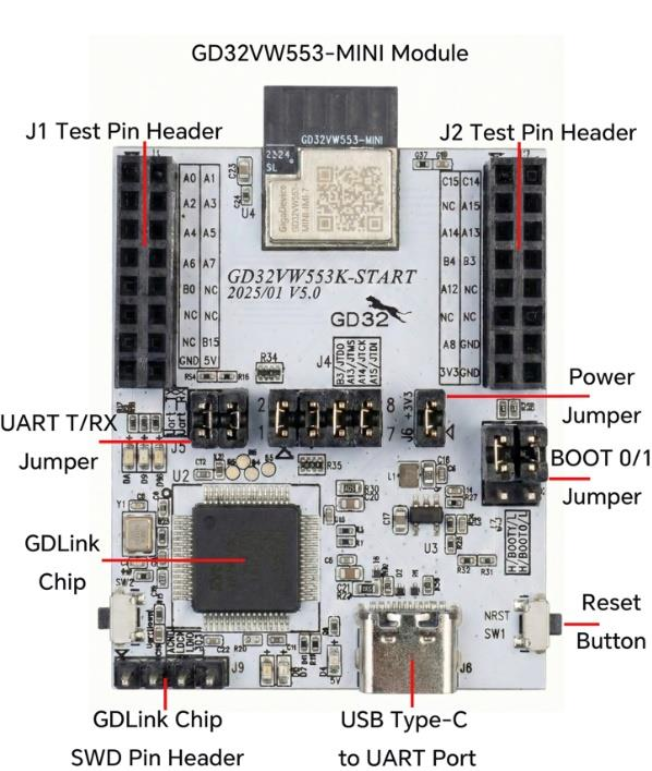

================
GD32VW553K-START
================

The GD32VW553K-START is the GigaDevice evaluation board for the GD32VW553KMQ
(Nuclei N307, Wi-Fi 6 + BLE 5.3).  It carries an on-board GD-Link debug probe
which also provides the USB serial console.

   The GD32VW553K-START, carrying the GD32VW553-MINI module.

Features
========

- GD32VW553-MINI module with the GD32VW553KMQ (QFN32, 4096 KB flash,
  320 KB SRAM) and a PCB antenna
- On-board GD-Link probe: SWD/JTAG plus a USB CDC virtual COM port, both
  over the single USB Type-C connector
- Two test pin headers (J1, J2) breaking out the GPIOs
- BOOT0/BOOT1 jumpers, a power jumper and a reset button (NRST)
- Three user LEDs on GPIOC

Serial Console
==============

The console is UART2 (PA6 TX / PA7 RX), wired to the GD-Link virtual COM port.
It shows up on the host as ``/dev/ttyACM0`` at 115200 8N1.

LEDs
====

Three LEDs sit on GPIOC and are driven push-pull, active HIGH.  In the vendor
SDK they are named LED_RUN, LED_SLEEP and LED_RX.

====== ==== =========================================
LED    Pin  Meaning in the vendor SDK
====== ==== =========================================
LED1   PC0  CPU running
LED2   PC1  CPU sleeping
LED3   PC2  Reception
====== ==== =========================================

With ``CONFIG_USERLED`` they belong to the application and are exposed as
``/dev/userleds``.  With ``CONFIG_ARCH_LEDS`` the OS takes them over instead
and uses them to show its state: LED1 comes on once NuttX has started, LED2
joins it when the idle stack exists, and LED3 signals an assertion or a
panic.  The two modes are mutually exclusive.

Pin headers
===========

The user I/O of the module is broken out on two 2x8 test-pin headers, J1 and
J2.  The tables below follow the board silkscreen (AN154 Figure 1-1) top to
bottom: the first two columns are the left row of the header, the last two the
right row.  Several positions are wired to nothing (``NC``); the alternate
functions listed are the ones this port uses or reserves, and every other line
is a plain GPIO.  The silkscreen abbreviates the port letter (``A0`` is PA0,
``B15`` is PB15, ``C15`` is PC15).

.. table:: J1 -- user GPIO, +5V and GND

   ======== =================== ======== ===================
   Signal   Function            Signal   Function
   ======== =================== ======== ===================
   PA0      GPIO                PA1      GPIO
   PA2      GPIO                PA3      GPIO
   PA4      GPIO                PA5      GPIO
   PA6      UART2_TX (console)  PA7      UART2_RX (console)
   PB0      GPIO                NC       --
   NC       --                  NC       --
   NC       --                  PB15     GPIO
   GND      ground              +5V      power in/out
   ======== =================== ======== ===================

.. table:: J2 -- user GPIO (shared with JTAG), +3V3 and GND

   ======== =================== ======== ===================
   Signal   Function            Signal   Function
   ======== =================== ======== ===================
   PC15     GPIO                PC14     GPIO
   NC       --                  PA15     JTDI
   PA14     JTCK                PA13     JTMS
   PB4      JNTRST              PB3      JTDO
   PA12     GPIO                NC       --
   NC       --                  NC       --
   PA8      GPIO                GND      ground
   +3V3     3.3V power test     GND      ground
   ======== =================== ======== ===================

.. note::
   PA13/PA14/PA15/PB3/PB4 on J2 are the chip's JTAG pins, wired to the on-board
   GD-Link through the J4 shorting caps.  Use them as plain GPIO only after
   removing those caps, or the debug probe and the application will fight over
   the lines.

Flashing
========

The board is programmed with OpenOCD through the GD-Link probe.  The GigaDevice
OpenOCD fork (shipped with the vendor SDK) is required::

  $ openocd -f openocd_gdlink.cfg \
            -c "program nuttx.bin 0x08000000 verify reset exit"

NuttX is linked at 0x08000000, bypassing the vendor MBL bootloader.

.. note::
   The chip mask ROM uses the first 0x200 bytes of SRAM.  The linker script
   starts the application at 0x20000200 for that reason; do not move it.

Flash layout
============

The full map is in the :doc:`chip documentation <../../index>`.  What matters
when flashing this board:

======================== ============== ====================================
Range                    Size           Purpose
======================== ============== ====================================
0x08000000 -- 0x083db000 3948 KiB       Available to the firmware.  This is
                                        what the linker script gives out;
                                        overflowing it is a link error
0x083db000 -- 0x083fb000 128 KiB        progmem / LittleFS
0x083fb000 -- 0x08400000 20 KiB         **Wi-Fi NVDS** -- do not erase
======================== ============== ====================================

For reference, the configurations use a small part of that budget: ``nsh``
135 KiB (3%), ``periph`` 154 KiB (4%), ``littlefs`` 195 KiB (5%), ``wapi``
610 KiB (15%) and ``sta_softap`` 613 KiB (16%).  The ``ble`` config (BLE on top
of ``wapi``) brings the image to about 971 KiB (25%).

.. warning::
   The **last** pages of the flash are not free: the Wi-Fi NVDS holds the RF
   calibration data and the MAC address, and erasing it breaks the radio.  The
   progmem region ends exactly where the NVDS begins.

The region handed to progmem is set with
``CONFIG_GD32VW55X_PROGMEM_START_ADDR`` and ``CONFIG_GD32VW55X_PROGMEM_SIZE``;
nothing outside it is ever erased or written.

Configurations
==============

Each configuration is built with::

  $ ./tools/configure.sh gd32vw553k-start:<config>
  $ make

nsh
---

Basic NuttShell configuration over the UART2 console.  No radio.

wapi
----

NSH plus the Wi-Fi station support.  The interface is registered as ``wlan0``
with the MAC address read from the chip eFuse, and is driven with the standard
network tools::

  nsh> wapi scan wlan0
  nsh> wapi psk wlan0 <passphrase> 3
  nsh> wapi essid wlan0 <ssid> 1
  nsh> ifup wlan0
  nsh> renew wlan0
  nsh> ifconfig
  nsh> ping 8.8.8.8

.. note::
   Use ``ifup wlan0``, not ``ifconfig wlan0 up``: ``ifconfig`` interprets its
   second argument as an IP address.

.. note::
   The station is WPA2-only. A WPA3-transition network (WPA2/WPA3 mixed
   mode) associates through WPA2-PSK; a WPA3(SAE)-only network is refused
   up front with ``ENOTSUP`` and a console message naming the unsupported
   AKM, instead of letting the prebuilt supplicant attempt the SAE
   handshake (which faults).

The RTC and the SNTP client are enabled, so the clock can be set from the
network::

  nsh> ntpcstart
  nsh> date

periph
------

NSH plus every peripheral driver (DMA, GPIO/EXTI, SPI, I2C, ADC, PWM, input
capture, both watchdogs, progmem, TRNG and CRC), registered as ``/dev/i2c0``,
``/dev/spi0``, ``/dev/adc0``, ``/dev/pwm0``, ``/dev/capture0``,
``/dev/watchdog0`` and ``/dev/watchdog1``.  No radio.

littlefs
--------

NSH with the last 128 KiB of usable flash (below the Wi-Fi NVDS) exposed as an
MTD device, ``/dev/gd32flash``, and mounted as LittleFS on ``/data``.

.. note::
   The erase page is 4 KiB, so the LittleFS size factors must be left at 1
   (``CONFIG_FS_LITTLEFS_PROGRAM_SIZE_FACTOR`` and friends).  With the default
   factor of 4 the program size becomes 16 KiB on a 4 KiB block: littlefs then
   writes past the page it erased, and the filesystem corrupts in confusing
   ways (``ENAMETOOLONG`` on a short name, ``ENOSPC`` on an empty volume).

Build and flash it::

  $ ./tools/configure.sh gd32vw553k-start:littlefs
  $ make
  $ openocd -f openocd_gdlink.cfg \
            -c "program nuttx.bin 0x08000000 verify reset exit"

The partition is formatted on the first boot (the board mounts it from
``gd32_bringup()``), so it is ready to use as soon as NSH comes up::

  nsh> mount
    /data type littlefs
    /proc type procfs

  nsh> df -h
    Filesystem      Size      Used  Available Mounted on
    littlefs        128K        8K       120K /data
    procfs            0B        0B         0B /proc

Write and read a file back::

  nsh> echo "NuttX on GD32VW553" > /data/hello.txt
  nsh> cat /data/hello.txt
  NuttX on GD32VW553

  nsh> ls -l /data
  /data:
   drwxrwxrwx           0 .
   dr--r--r--           0 ..
   -rw-rw-rw-          19 hello.txt

The contents survive a reset, since they are in flash::

  nsh> reboot
  NuttShell (NSH) NuttX-13.0.0

  nsh> mount
    /data type littlefs
    /proc type procfs

  nsh> cat /data/hello.txt
  NuttX on GD32VW553

.. note::
   The NSH command is ``reboot`` (there is no ``reset`` command).  It needs
   ``CONFIG_BOARDCTL_RESET``, which every configuration of this board enables;
   the board resets the core through the Nuclei SysTimer software reset
   request, the same way the vendor SDK does.

To start from a clean volume, erase the region with the debug probe and let
the next boot format it again::

  $ openocd -f openocd_gdlink.cfg \
            -c "init; halt; flash erase_address 0x083db000 0x20000; reset; exit"

.. warning::
   Erase only the progmem region.  The Wi-Fi NVDS lives immediately above it,
   at 0x083fb000; wiping it takes the RF calibration and the MAC address with
   it.  After using the filesystem, ``wapi scan wlan0`` in the ``wapi``
   configuration is a quick way to confirm the radio is still healthy.

sta_softap
----------

NSH plus the Wi-Fi softAP: the board becomes an access point and a DHCP server.
The single-VIF firmware does station *or* AP at a time (not both at once), so
this is a softAP, not the simultaneous STA+AP of some other parts.

Bring it up with the standard tools::

  nsh> wapi mode  wlan0 3            # 3 = master (softAP)
  nsh> wapi psk   wlan0 12345678 3   # WPA2-PSK
  nsh> wapi essid wlan0 nuttxwifi 1  # start the AP
  nsh> dhcpd_start wlan0             # DHCP server, in the background

A client then sees ``nuttxwifi``, associates with WPA2, and gets an address
from the 10.0.0.0/24 pool (the AP is 10.0.0.1).

.. note::
   Use WPA2, not WPA3.  The SAE (WPA3) handshake on the AP side is deep on the
   stack; with the default task stacks it overflows inside the elliptic-curve
   crypto and faults.  This configuration raises ``CONFIG_INIT_STACKSIZE`` to
   8192 and ``CONFIG_DEFAULT_TASK_STACKSIZE`` to 4096 for the same reason -- the
   radio tasks need the headroom.

.. note::
   ``dhcpd_start`` spawns the server as a background task and returns.  The
   plain ``dhcpd`` command, confusingly, runs the server *blocking* in the
   foreground.

ble
---

``wapi`` plus BLE (``CONFIG_GD32VW55X_BLE``) and the demo GATT service
(``CONFIG_GD32VW55X_BLE_GATT_DEMO``).  The board advertises a connectable set
named ``NuttX`` and registers a minimal "transparent UART" service (16-bit
UUIDs ``0xffe0`` / RX ``0xffe1`` / TX ``0xffe2``).  A central connects,
discovers the service, and a write to the RX characteristic is logged on the
board console::

  nsh> BLE RX (11): Hello world

.. note::
   The central -> board write is exercised with a write command
   (write-without-response), which is reliable.  The prebuilt vendor
   controller does not complete a write-request (write-with-response) or the
   CCCD subscribe issued by a Linux BlueZ host, so the TX **notification** echo
   (board -> central) is best exercised from a phone app such as nRF Connect.
   This is why BLE keeps ``CONFIG_EXPERIMENTAL``.

ostest
------

``nsh`` plus the NuttX OS test suite (``CONFIG_TESTING_OSTEST``).  Run it from
the shell to exercise the scheduler, synchronisation primitives and the FPU
context switch::

  nsh> ostest
  ...
  ostest_main: Exiting with status 0

The ``rr_test`` (round-robin with a 30000-prime workload) makes the full run
take a couple of minutes on this core; every sub-test reports ``nerrors=0``.

Status
======

All seven configurations were validated on hardware:

- ``nsh``: boots, console, heap and task list are healthy.
- ``littlefs``: the partition is formatted on the first boot, files are written
  and read back, and they survive both a ``reboot`` and a re-flash.
- ``periph``: every driver registers (``/dev/i2c0``, ``/dev/spi0``,
  ``/dev/adc0``, ``/dev/pwm0``, ``/dev/capture0``, ``/dev/watchdog0``,
  ``/dev/watchdog1``, ``/dev/userleds``, ``/dev/random``).  The TRNG returns
  fresh entropy on each read, and the three LEDs work.
- ``wapi``: full station path over a live AP -- ``wapi scan`` lists the nearby
  networks, WPA2 associates through the four-way handshake, DHCP obtains an
  address, and ``ping`` reaches the internet.
- ``sta_softap``: the board's own AP -- a client sees the SSID, associates with
  WPA2, gets an address from the board's DHCP server, and pings the board.
- ``ble``: advertises ``NuttX``, a central connects, the demo GATT service
  enumerates, and a write to the RX characteristic is received on the board
  console (central -> board).
- ``ostest``: the OS test suite runs to completion (every sub-test reports
  ``nerrors=0`` and it ends with ``ostest_main: Exiting with status 0``).

BLE (``CONFIG_GD32VW55X_BLE``) is marked EXPERIMENTAL and off by default.  The
prebuilt ``libble`` is an all-in-one controller plus RivieraWaves host with no
HCI transport, so the port drives the vendor host directly (it does not
register a NuttX ``bt_driver_s``).  The ``ble`` configuration enables it along
with a demo GATT service; see that section above for what is validated and the
notification caveat.  A reusable test tool for this is kept with the
out-of-tree port notes.

.. note::
   ``CONFIG_ARCH_LEDS`` must stay off on this board.  With the OS driving the
   LEDs, the serial console dies in the Wi-Fi configurations (the console UART
   shares the work queue path); the LEDs belong to the application
   (``CONFIG_USERLED``), and every defconfig here disables ``ARCH_LEDS``
   explicitly.
